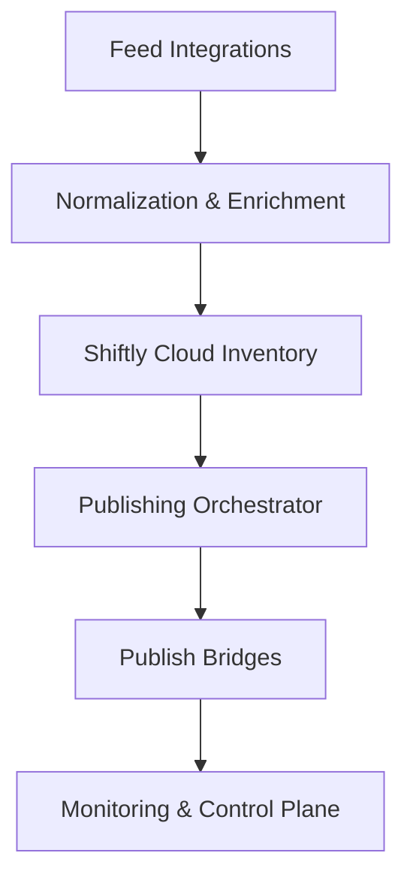

# SHIFTLY AUTO — SAFE INFRASTRUCTURE BLUEPRINT

## A) SERVER ARCHITECTURE DIAGRAM + STACK

```mermaid
graph TD
    A[Feed Integrations]
    B[Normalization & Enrichment]
    C[Shiftly Cloud Inventory]
    D[Publishing Orchestrator]
    E[Publish Bridges]
    F[Monitoring & Control Plane]

    A --> B
    B --> C
    C --> D
    D --> E
    E --> F
```
(Truncated for brevity; full architecture details go here)
